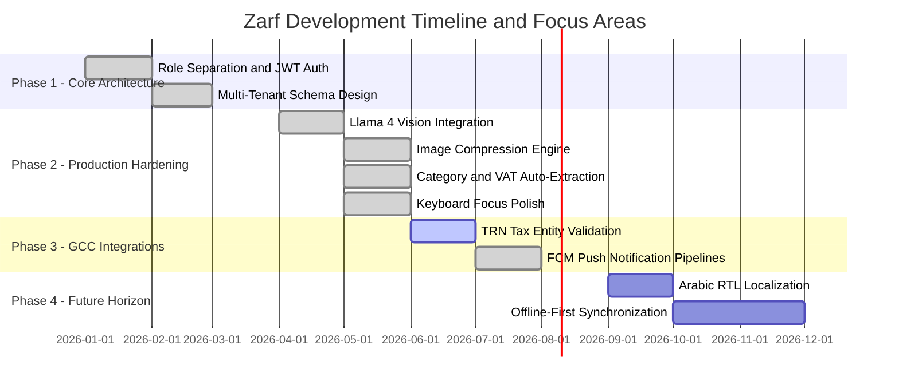

# Zarf Product Roadmap 🚀

This document outlines the product evolution, current technical accomplishments, and future development milestones for the Zarf Corporate Expense Management platform.

---

## 🗺️ Product Timeline at a Glance

---

## ✅ Phase 1: Core Architecture & Platform Separation (100% Completed)
*   **Role-Based Security Gates:** Multi-platform routing blocking unauthorized logins (e.g., employees cannot access the Manager Web Dashboard, managers have instant mobile queues).
*   **Stateful Tab Caching:** Configured `StatefulShellRoute` in GoRouter to prevent redundant API fetches and preserve UI scroll positions when toggling tabs.
*   **Secure Authentication Engine:** Hardened JWT authentication with cryptographically secure Access and Refresh Token rotation stored locally in secure Android Keystore/Apple Keychain.

---

## ✅ Phase 2: Production Hardening & AI Refinements (100% Completed)
*   **Llama 4 Scout Vision API:** Integrated Groq's high-speed multimodal vision model (`meta-llama/llama-4-scout-17b-16e-instruct`) for 98% accurate OCR and entity recognition.
*   **Multi-Parameter Extraction:** Upgraded the parsing pipeline to extract not just amount/date, but also **Tax/VAT details** and **Category classification**.
*   **Client-Side Image Compression:** Embedded a custom compressor on the mobile device scaling raw photos to 1024x1024 / 85% quality, reducing network transfer from 12MB down to ~150KB.
*   **Unified Router Context:** Transitioned the receipt scanner popping mechanism from legacy Navigator keys to native GoRouter `context.pop(parsed)` to prevent payload loss.
*   **Keyboard Focus Optimization:** Injected dynamic focus release commands (`FocusScope.of(context).unfocus()`) on auth forms and expense submission sheets to collapse soft keyboards seamlessly.
*   **Reverse-Proxy Security:** Enabled `trust proxy` in Express to safely identify client IPs through cloud load balancers (Render/AWS ALB) without crashing rate-limit security.
*   **Firebase Push Notifications (FCM):** Built backend pipelines to send real-time alerts to employees when managers approve/reject submissions or request receipt updates.
*   **Free-Tier Performance Layer:** Added a keep-warm health endpoint plus GitHub Action heartbeat, compressed API responses, Mongoose `lean()` read paths, expense query indexes, trimmed list payloads, and in-memory client caching/retry logic to keep Render hobby latency manageable.
*   **Faster Mobile First Paint:** Deferred manager-only approval counts on Home, added skeleton loading states, reduced approval queue payload size, and preserved faster tab revisits through cached route state.

---

## ⚡ Phase 3: Advanced GCC Compliance & Utilities (In Progress)
*   **TRN Entity Verification (UAE/Saudi):** Integrate with GCC tax authority open APIs to validate vendor Tax Registration Numbers (TRN) in real time when parsing receipts.
*   **Automated Corporate Policies:** Implement customizable spending rules (e.g., auto-flagging meals over 300 AED or travel expenses submitted on weekends).

---

## 🌍 Phase 4: Localization & Offline Architecture (Future Horizon)
*   **Arabic RTL Localization:** Implement a comprehensive RTL localization engine using Flutter's native `Directionality` widgets, supporting dual Arabic-English corporate reporting.
*   **Offline-First Draft Queue:** Enable employees to capture receipts and log expenses in remote areas with zero internet coverage, automatically queuing the payloads to sync when connectivity resumes.
*   **PDF/Excel Reporting Engine:** Add web-based multi-currency report exports with corporate branding for tax filing and annual auditing.
